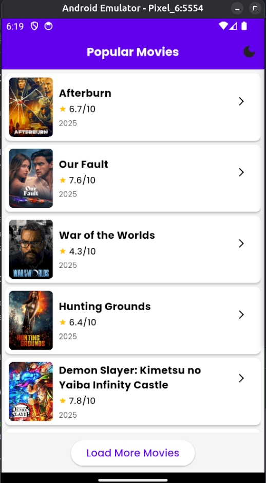
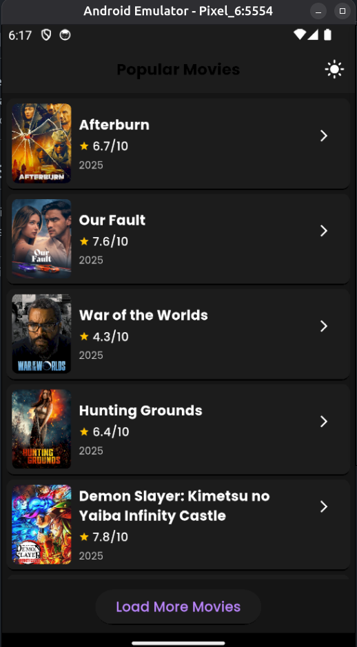
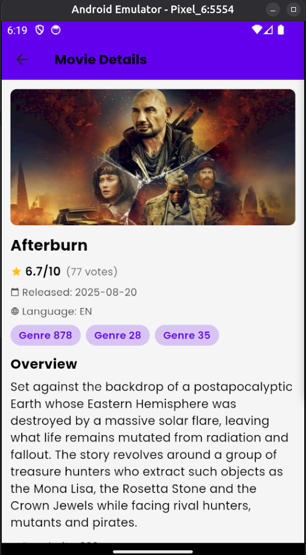
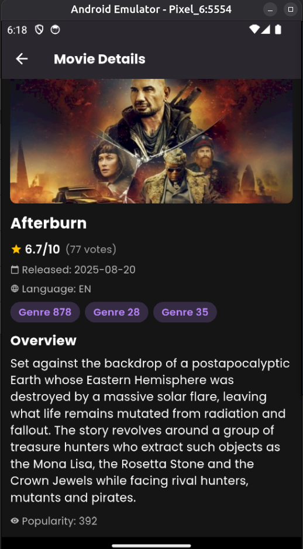

# 🎬 Movie App - Flutter Application

A comprehensive Flutter movie application built with Clean Architecture, featuring popular movies from TMDB API with advanced features including theme management, pagination, local caching, and error logging.

## 📋 Table of Contents

- [Overview](#overview)
- [Features](#features)
- [Project Structure](#project-structure)
- [Technical Stack](#technical-stack)
- [Architecture](#architecture)
- [Implementation Details](#implementation-details)
  - [Light and Dark Theming](#1-light-and-dark-theming)
  - [Pagination](#2-pagination)
  - [Caching](#3-caching)
  - [Error Logging](#4-error-logging)
- [API Integration](#api-integration)
- [State Management](#state-management)
- [Setup Instructions](#setup-instructions)
- [Screenshots](#screenshots)

---

## Overview

This Flutter application demonstrates best practices in mobile app development by implementing:

- **Clean Architecture** with separation of concerns
- **State Management** using BLoC/Cubit pattern
- **Theme Management** with persistent light/dark mode
- **Data Caching** using Hive for offline support
- **Pagination** for efficient data loading
- **Error Logging** with Firebase Crashlytics

The app fetches popular movies from The Movie Database (TMDB) API and provides a smooth user experience with offline capabilities.

---

## Features

### ✅ Core Features Implemented

1. **🎨 Light & Dark Theming**
   - Seamless theme switching
   - Persistent theme preference
   - Material Design 3 theming

2. **📄 Pagination**
   - Load More button implementation
   - Efficient page-based data loading
   - Loading state management

3. **💾 Local Caching**
   - Hive-based local storage
   - Per-page caching mechanism
   - Cache expiration (1 hour)
   - Offline fallback support

4. **📊 Error Logging**
   - Firebase Crashlytics integration
   - Global error handling
   - Flutter and platform error tracking

5. **🎯 Additional Features**
   - Movie details screen
   - Image caching with placeholders
   - Responsive UI with ScreenUtil
   - Error handling with retry mechanism

---

## Project Structure

The project follows **Clean Architecture** principles with clear separation of concerns:

```
lib/
├── core/                           # Core functionality shared across features
│   ├── api/
│   │   └── api_service.dart       # HTTP client setup (Dio)
│   ├── constants/
│   │   └── api_constants.dart     # API endpoints and configuration
│   └── theme/
│       ├── app_theme.dart         # Theme configurations
│       ├── colors.dart            # Color definitions
│       └── text_styles.dart       # Typography styles
│
├── features/                       # Feature modules
│   ├── home/                      # Home/Movies feature
│   │   ├── data/
│   │   │   ├── datasources/
│   │   │   │   ├── local_data_source.dart    # Hive caching implementation
│   │   │   │   └── remote_data_source.dart   # API data fetching
│   │   │   ├── models/
│   │   │   │   └── movie_model.dart          # Movie data model
│   │   │   └── repositories/
│   │   │       └── movie_repository_impl.dart # Repository implementation
│   │   └── presentation/
│   │       ├── cubit/
│   │       │   ├── cubit/
│   │       │   │   ├── movie_cubit.dart      # Business logic
│   │       │   │   └── movie_state.dart      # State definitions
│   │       └── view/
│   │           └── home_screen.dart          # UI layer
│   │
│   └── details/                   # Movie details feature
│       └── presentation/
│           └── view/
│               └── details_screen.dart       # Movie details UI
│
├── firebase_options.dart           # Firebase configuration
└── main.dart                       # App entry point
```

### Architecture Layers

1. **Presentation Layer** (`features/*/presentation/`)
   - UI components (Widgets/Screens)
   - State management (BLoC/Cubit)

2. **Domain Layer** (implicit - interfaces in repositories)
   - Business logic contracts
   - Repository abstractions

3. **Data Layer** (`features/*/data/`)
   - Data sources (Remote & Local)
   - Repository implementations
   - Models

4. **Core Layer** (`core/`)
   - Shared utilities
   - API services
   - Theme configurations
   - Constants

---

## Technical Stack

### Dependencies

| Package | Version | Purpose |
|---------|---------|---------|
| `flutter_bloc` | ^9.1.1 | State management (BLoC pattern) |
| `dio` | ^5.4.0 | HTTP client for API calls |
| `hive` | ^2.2.3 | Local NoSQL database for caching |
| `hive_flutter` | ^1.1.0 | Hive Flutter integration |
| `firebase_core` | ^4.2.0 | Firebase core functionality |
| `firebase_crashlytics` | ^5.0.3 | Crash reporting and error logging |
| `shared_preferences` | ^2.2.2 | Theme preference persistence |
| `cached_network_image` | ^3.4.1 | Network image caching |
| `flutter_screenutil` | ^5.9.3 | Responsive UI sizing |
| `google_fonts` | ^6.3.2 | Custom typography |
| `equatable` | ^2.0.7 | Value equality comparison |

### Dev Dependencies

- `flutter_lints`: ^5.0.0 - Code linting rules

---

## Architecture

### Clean Architecture Flow

```
UI (Widget) 
    ↓
Cubit (State Management)
    ↓
Repository (Interface)
    ↓
    ├── Remote Data Source → API Service → TMDB API
    └── Local Data Source → Hive → Local Storage
```

### State Management Pattern

The app uses **BLoC/Cubit** pattern for state management:

- **MovieCubit**: Manages movie list state, pagination, and theme
- **MovieState**: Different states (Initial, Loading, Loaded, Error)
- State changes trigger UI rebuilds through `BlocBuilder`

---

## Implementation Details

### 1. Light and Dark Theming

#### Implementation

The theming system is implemented in `lib/core/theme/`:

**Theme Definition** (`app_theme.dart`):
- Separate `lightTheme` and `darkTheme` configurations
- Material Design 3 support
- Custom color schemes for both themes

**Color Definitions** (`colors.dart`):
```dart
// Light Theme
static const Color lightPrimary = Color(0xFF6200EE);
static const Color lightBackground = Color(0xFFF5F5F5);
static const Color lightCard = Color(0xFFFFFFFF);

// Dark Theme
static const Color darkPrimary = Color(0xFFBB86FC);
static const Color darkBackground = Color(0xFF121212);
static const Color darkCard = Color(0xFF1E1E1E);
```

**Theme Persistence**:
- Uses `SharedPreferences` to store theme preference
- Preference key: `'is_dark_mode'`
- Theme state is loaded on app startup
- Theme toggle persists across app restarts

**Theme Toggle Implementation** (`movie_cubit.dart`):
```dart
Future<void> toggleTheme() async {
  final currentState = state;
  final newDarkMode = !currentState.isDarkMode;
  
  await sharedPreferences.setBool(_themeKey, newDarkMode);
  
  // Emit new state with updated theme
  emit(currentState.copyWith(isDarkMode: newDarkMode));
}
```

**UI Integration**:
- Theme toggle button in `AppBar` (moon/sun icon)
- Theme mode switches between `ThemeMode.light` and `ThemeMode.dark`
- All UI components automatically adapt to current theme

---

### 2. Pagination

#### Implementation

Pagination is implemented using a **"Load More"** button approach:

**State Management** (`movie_state.dart`):
```dart
final class MovieLoaded extends MovieState {
  final List<MovieModel> movies;
  final int currentPage;
  final int totalPages;
  final bool hasMorePages;
  final bool isLoadingMore;
}
```

**Pagination Logic** (`movie_cubit.dart`):
- Initial load fetches page 1
- `loadMoreMovies()` increments `currentPage` and fetches next page
- New movies are appended to existing list
- `hasMorePages` is calculated based on `currentPage < totalPages`

**Load More Flow**:
```dart
Future<void> loadMoreMovies() async {
  final nextPage = currentState.currentPage + 1;
  final response = await repository.getPopularMovies(page: nextPage);
  
  final updatedMovies = [...currentState.movies, ...response.results];
  
  emit(currentState.copyWith(
    movies: updatedMovies,
    currentPage: response.page,
    hasMorePages: response.page < response.totalPages,
  ));
}
```

**UI Implementation** (`home_screen.dart`):
- "Load More Movies" button appears when `hasMorePages` is true
- Button shows loading spinner when `isLoadingMore` is true
- Button is disabled during loading to prevent multiple requests
- "No more movies to load" message when all pages are loaded

---

### 3. Caching

#### Implementation

Local caching is implemented using **Hive** for fast, NoSQL local storage:

**Cache Strategy**:
- **Cache Duration**: 1 hour validity
- **Storage**: Per-page caching (each page cached separately)
- **Fallback**: Returns cached data if remote fetch fails (even if expired)

**Hive Implementation** (`local_data_source.dart`):

```dart
class LocalDataSourceImpl implements LocalDataSource {
  static const String moviesBoxName = 'movies_box';
  static const Duration cacheValidDuration = Duration(hours: 1);
  
  // Cache movies per page
  Future<void> cacheMovies(List<MovieModel> movies, {int page = 1}) async {
    final box = await Hive.openBox<dynamic>(moviesBoxName);
    final cacheKey = 'movies_page_$page';
    
    await box.put(cacheKey, {
      'movies': movies.map((m) => m.toJson()).toList(),
      'page': page,
      'timestamp': DateTime.now().toIso8601String(),
    });
  }
}
```

**Cache Validation**:
```dart
bool isCacheValid(DateTime? timestamp) {
  if (timestamp == null) return false;
  final now = DateTime.now();
  return now.difference(timestamp) < cacheValidDuration;
}
```

**Repository Cache Strategy** (`movie_repository_impl.dart`):
1. Check cache first (if not forcing refresh)
2. Validate cache timestamp (must be < 1 hour old)
3. Return cached data if valid
4. Otherwise, fetch from remote API
5. Cache new data after successful fetch
6. Fallback to cache (even expired) if remote fails

**Benefits**:
- ⚡ Faster load times for previously viewed pages
- 📴 Offline support (shows cached data when offline)
- 🔄 Automatic cache refresh after expiration
- 💾 Efficient storage with Hive's binary format

---

### 4. Error Logging

#### Implementation

Error logging is implemented using **Firebase Crashlytics**:

**Initialization** (`main.dart`):

```dart
void main() async {
  WidgetsFlutterBinding.ensureInitialized();
  await Firebase.initializeApp(options: DefaultFirebaseOptions.currentPlatform);
  
  // Initialize Firebase Crashlytics
  FlutterError.onError = FirebaseCrashlytics.instance.recordFlutterError;
  
  PlatformDispatcher.instance.onError = (error, stack) {
    FirebaseCrashlytics.instance.recordError(error, stack, fatal: true);
    return true;
  };
  
  // Zone-based error catching
  runZonedGuarded(
    () async {
      runApp(MyApp(sharedPreferences: sharedPreferences));
    },
    (error, stack) {
      FirebaseCrashlytics.instance.recordError(error, stack, fatal: true);
    },
  );
}
```

**Error Handling Levels**:

1. **Flutter Framework Errors**:
   - Caught via `FlutterError.onError`
   - Records widget build errors, rendering issues

2. **Platform Errors**:
   - Caught via `PlatformDispatcher.instance.onError`
   - Records native platform errors

3. **Zoned Errors**:
   - Caught via `runZonedGuarded`
   - Catches all unhandled async errors

**Error Reporting**:
- All errors are automatically sent to Firebase Crashlytics
- Includes full stack traces for debugging
- Fatal vs non-fatal error classification
- Real-time crash reporting dashboard

**Benefits**:
- 🐛 Comprehensive error tracking
- 📊 Real-time crash analytics
- 🔍 Detailed stack traces
- 📱 Production error monitoring

---

## API Integration

### TMDB API

The app integrates with **The Movie Database (TMDB) API**:

**Base Configuration** (`api_constants.dart`):
```dart
static const String baseUrl = 'https://api.themoviedb.org/3';
static const String bearerToken = '...'; // API bearer token
static const String imageBaseUrl = 'https://image.tmdb.org/t/p/w500';
static const String popularMoviesEndpoint = '/movie/popular';
```

**API Service** (`api_service.dart`):
- Uses `Dio` for HTTP requests
- Bearer token authentication
- 30-second timeout configuration
- Error handling with `DioException`

**Endpoint Used**:
- `GET /movie/popular` - Fetch popular movies with pagination

**Query Parameters**:
- `page`: Page number (default: 1)
- `language`: Language code (default: 'en-US')

**Response Structure**:
```json
{
  "page": 1,
  "results": [...],
  "total_pages": 500,
  "total_results": 10000
}
```

---

## State Management

### BLoC/Cubit Pattern

**MovieCubit** (`movie_cubit.dart`):
- Manages application state
- Handles business logic
- Coordinates between UI and data layers

**State Classes** (`movie_state.dart`):

1. **MovieInitial**: Initial app state
2. **MovieLoading**: Loading state (initial fetch)
3. **MovieLoaded**: Success state with movies list
4. **MovieError**: Error state with error message

**State Flow**:
```
Initial → Loading → Loaded/Error
                 ↓
            Load More → Loading More → Updated Loaded State
```

**State Properties**:
- `isDarkMode`: Theme preference (in all states)
- `movies`: List of movies (in Loaded state)
- `currentPage`: Current page number
- `totalPages`: Total available pages
- `hasMorePages`: Whether more pages are available
- `isLoadingMore`: Loading indicator for pagination

---

## Setup Instructions

### Prerequisites

- Flutter SDK (3.9.2 or higher)
- Dart SDK (included with Flutter)
- Android Studio / VS Code
- Firebase account (for Crashlytics)
- TMDB API key (or use provided token)

### Installation Steps

1. **Clone the repository**:
   ```bash
   git clone <repository-url>
   cd movie
   ```

2. **Install dependencies**:
   ```bash
   flutter pub get
   ```

3. **Firebase Setup**:
   - Create a Firebase project
   - Add Android/iOS apps to Firebase console
   - Download `google-services.json` (Android)
   - Download `GoogleService-Info.plist` (iOS)
   - Place files in respective platform folders
   - Run `flutterfire configure` or manually configure

4. **API Configuration**:
   - Optionally update API token in `lib/core/constants/api_constants.dart`
   - Current implementation uses a provided bearer token

5. **Run the app**:
   ```bash
   flutter run
   ```

### Platform-Specific Setup

#### Android
- Ensure `google-services.json` is in `android/app/`
- Minimum SDK version: Check `android/app/build.gradle.kts`

#### iOS
- Ensure `GoogleService-Info.plist` is in `ios/Runner/`
- Run `pod install` in `ios/` directory

---

## Screenshots

### Home Screen

#### Light Theme

- List of popular movies with posters
- Theme toggle button in AppBar (moon icon)
- Load More button for pagination
- Clean, bright interface

#### Dark Theme

- Same functionality with dark theme
- Theme toggle button in AppBar (sun icon)
- Reduced eye strain in low-light conditions

### Details Screen

#### Light Theme

- Movie details with backdrop/poster
- Rating with star icon and vote count
- Release date and language information
- Genre tags display
- Full movie overview

#### Dark Theme

- Same details with dark theme styling
- Enhanced readability in dark mode
- Consistent theming throughout the app

### Theme Support
- **Light mode**: Clean, bright interface with vibrant colors
- **Dark mode**: Dark theme optimized for reduced eye strain and battery saving
- Seamless theme switching with persistent preference

---

## Code Examples

### Fetching Movies with Caching

```dart
// Repository automatically handles caching
final response = await repository.getPopularMovies(
  page: 1,
  forceRefresh: false, // Uses cache if available
);
```

### Theme Toggle

```dart
// In UI
IconButton(
  onPressed: () {
    context.read<MovieCubit>().toggleTheme();
  },
  icon: Icon(isDarkMode ? Icons.light_mode : Icons.dark_mode),
)
```

### Pagination

```dart
// Load more movies
if (state.hasMorePages && !state.isLoadingMore) {
  context.read<MovieCubit>().loadMoreMovies();
}
```

---

## Project Architecture Benefits

✅ **Scalability**: Easy to add new features
✅ **Testability**: Clear separation allows unit testing
✅ **Maintainability**: Organized code structure
✅ **Reusability**: Core utilities shared across features
✅ **Performance**: Efficient caching and state management

---

## Future Enhancements

Potential improvements:
- Search functionality
- Movie favorites/bookmarks
- User authentication
- Reviews and ratings
- Trailers integration
- Advanced filtering and sorting

---

## License

This project is created for educational purposes.

---

## Acknowledgments

- **The Movie Database (TMDB)** for providing the API
- **Flutter Team** for the amazing framework
- **Firebase** for error logging services

---

## Contact & Support

For questions or issues, please refer to the project documentation or create an issue in the repository.

---

**Built with ❤️ using Flutter**
